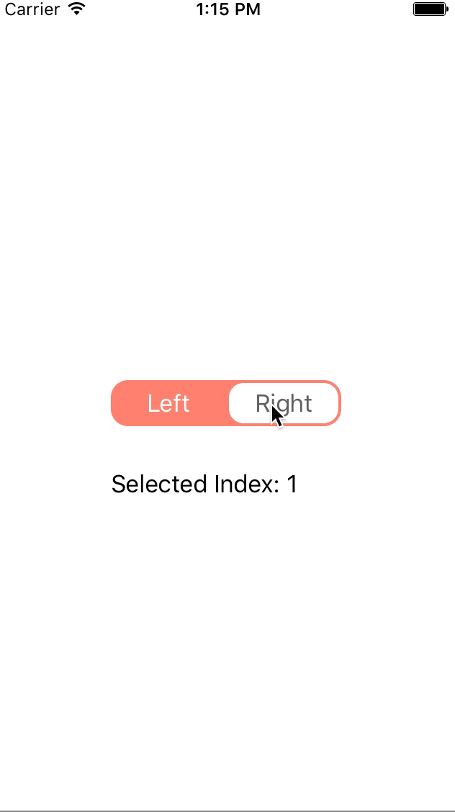

# IGSwitch

A customisable Switch based on UIControl and written in Swift 2.0.

## Example

## Requirements

+ Swift 2.0
+ iOS 8.0+

## Installation

Include the `IGSwitch.swift` source file directly in your project. Then in storyboard drag out a UIView to a scene and assign the class to it. Of course you can also add the switch programmatically.

## Author

Ian Gruenig - https://twitter.com/iangruenig

## License

MIT
